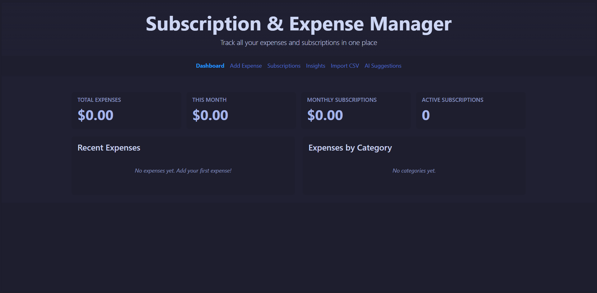

## Subscription & Expense Manager

A comprehensive React-based web application to track expenses and subscriptions in one centralized dashboard.

## Problem Statement
People often forget about their subscriptions and end up overspending on services they rarely use. Tracking multiple expenses across different platforms becomes overwhelming and leads to poor financial management.

## Solution
SubTrack provides a single, unified dashboard to track all your expenses and subscriptions with intelligent insights and alerts.

## Key Features

### 1. Manual/CSV Import
- Add expenses manually with detailed information (name, amount, category, date, notes)
- Add subscriptions with billing frequency tracking
- Import bulk expenses from CSV files
- Download CSV template for easy import

### 2. Monthly Insights & Analytics
- View total spending by month
- Category-based expense breakdown with visual progress bars
- Spending trends over the last 3 months
- Month-to-month comparison with percentage changes
- Top 5 expenses for any selected month
- Average daily spending calculations

### 3. Subscription Renewal Reminders
- Track all active subscriptions with renewal dates
- Automatic alerts for subscriptions renewing within 7 days
- Visual indicators for upcoming renewals
- Calculate monthly and annual subscription costs
- Track last used date for each subscription

### 4. Money Leak Detection
- Automatically detect unused subscriptions (not used in 30+ days)
- Alert system for potentially wasteful subscriptions
- Track subscription usage patterns
- Identify duplicate services in the same category

### 5. AI-Powered Savings Suggestions
- Smart recommendations based on spending patterns
- Identify opportunities to cancel unused subscriptions
- Detect duplicate or overlapping services
- Suggest annual billing switches for better savings
- Alert on unusual spending spikes
- Calculate potential monthly savings
- Priority-based suggestion system (high/medium/low)

## Screenshots

### Dashboard Overview


### Feature Interface 1


### Feature Interface 2


## Additional Features
- Local storage persistence (data saved in browser)
- Responsive design for mobile and desktop
- Clean, modern UI with gradient accents
- Real-time calculations and updates
- Category-based expense organization
- Transaction history with delete functionality

## Technology Stack
- React 19.2.4
- CSS3 with modern gradients and animations
- Local Storage API for data persistence
- CSV parsing for bulk imports

## Getting Started

### Installation
```bash
cd casestudy
npm install
```

### Running the Application
```bash
npm start
```

The application will open at [http://localhost:3000](http://localhost:3000)

## Usage Guide

### Adding Expenses
1. Navigate to "Add Expense" tab
2. Choose between "One-time Expense" or "Subscription"
3. Fill in the required fields (name and amount)
4. Select a category and date
5. For subscriptions, set billing frequency and renewal date
6. Add optional notes
7. Click "Add Expense" or "Add Subscription"

### Importing from CSV
1. Go to "Import CSV" tab
2. Download the CSV template (optional)
3. Prepare your CSV file with columns: name, amount, category, date, notes
4. Upload the file and preview the data
5. Click "Import Expenses" to add all entries

### Viewing Insights
1. Navigate to "Insights" tab
2. Select month and year from dropdowns
3. View spending statistics, category breakdowns, and trends
4. Compare current month with previous month
5. See top expenses for the selected period

### Managing Subscriptions
1. Go to "Subscriptions" tab
2. View all active subscriptions with details
3. See monthly and yearly totals
4. Check renewal dates and days remaining
5. Delete subscriptions you no longer need

### Getting AI Suggestions
1. Navigate to "AI Suggestions" tab
2. Review personalized savings recommendations
3. See potential monthly savings
4. Act on high-priority suggestions first
5. Understand how AI analyzes your spending patterns

## Data Structure

### Expense Object
```javascript
{
  id: timestamp,
  name: string,
  amount: number,
  category: string,
  date: YYYY-MM-DD,
  notes: string
}
```

### Subscription Object
```javascript
{
  id: timestamp,
  name: string,
  amount: number,
  category: string,
  frequency: 'monthly' | 'yearly' | 'weekly',
  nextRenewal: YYYY-MM-DD,
  lastUsed: YYYY-MM-DD,
  notes: string
}
```

## Categories
- Food & Dining
- Entertainment
- Transportation
- Shopping
- Bills & Utilities
- Health & Fitness
- Subscription
- Other

## Browser Compatibility
- Chrome (recommended)
- Firefox
- Safari
- Edge

## License
MIT

## Author
Full Stack Development 2 - Case Study Project

